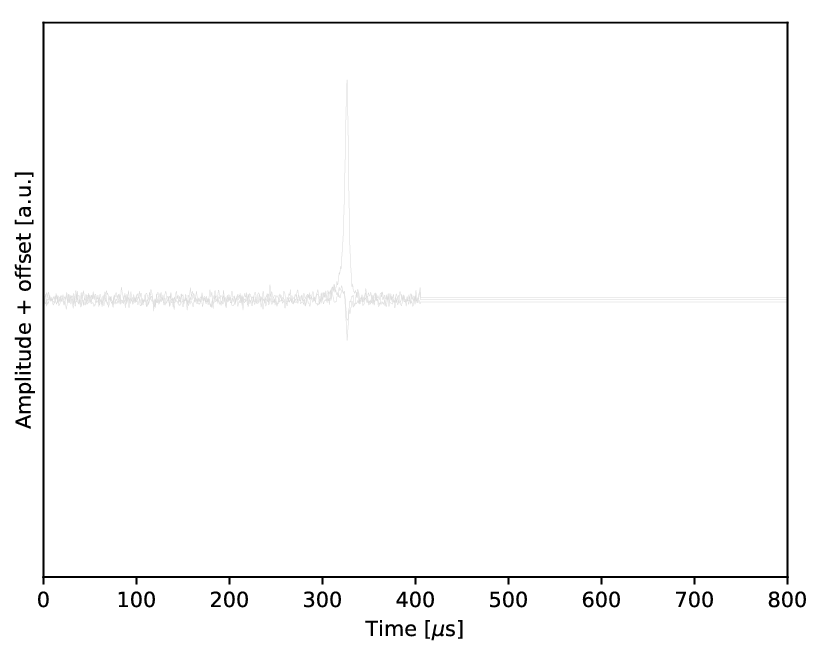

# nEXOSparse
A new signal/background classifier based on deep neural network using [PyTorch](https://pytorch.org/docs/stable/index.html). This classifier is developed for 0vbb events and radioactivity background separation in [the nEXO experiment](https://nexo.llnl.gov). The new classifier uses [SparseConvNet](https://github.com/facebookresearch/SparseConvNet) to solve the problem of size of current waveform in the other classifier.

## Requirements

- 1.[pytorch 1.1](https://github.com/pytorch/pytorch)
- 2.[SparseConvNet](https://github.com/facebookresearch/SparseConvNet)
- 3.[Python 3.6](https://www.python.org/downloads/release/python-360/)
- 4.[CUDA 9.0](https://developer.nvidia.com/cuda-90-download-archive)

## Input
The input of the network is composed with the waveform on a "hit" channel and its position on the anode.The length of the waveform is set to be 1700 with sampling rate of 2 MHz. In principle, the input could have multiple planes, similar to general deep neural network. SparseConvNet has its own input interface that does differently with general pytorch data loader. Currently, the X and Y channel are stitched into one plane, with each having 500 indices. An example input is shown in 

 

Input file is built with prepare_data.py, and saved in a pickle file.
